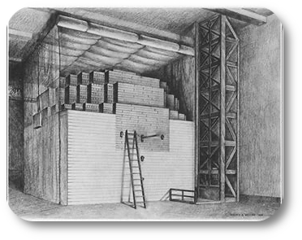

# The Legacy of the Manhatten Project

  

The Proof  Criticality; Growth without limit. Ultimate Negentropy, ultimate wealth</h3>

# Chicago. The Proof.

## December 2, 1942. Under the stands at Stagg Field, Fermi’s pile went critical.

Not a bomb. Not a weapon. A controlled, sustained chain reaction. The first artificial criticality. The proof that matter could be persuaded to release its binding energy on human terms.

## That single event is the hinge.

Criticality is the ultimate negentropy engine. A small mass of fissile material, arranged correctly, concentrates the diffuse energy locked in nuclear forces into usable work at densities no chemical process can touch. One kilogram of fully fissioned uranium or plutonium yields the energy of thousands of tons of coal—without the mountains of waste or the continuous harvest of sunlight and biomass. It is order extracted from the nucleus itself.

The Manhattan Project spent nearly two billion 1945 dollars to turn that proof into four devices. Measured purely by the mass converted in those explosions, the price was roughly $537 per microgram—more than a hundred times the retail cost of electricity in Seattle today. On that narrow ledger the first bombs look extravagant.

But the bombs were never the product. They were the stress test.

What was actually purchased was the industrial capability to reach and maintain criticality at will: the reactors, the enrichment cascades, the metallurgy, the control systems, the trained cadre. Once that platform existed, the marginal cost of additional energy collapsed. The same physics that made the Gadget possible makes high-density, dispatchable power possible for centuries. That is the definition of leverage.

Ultimate negentropy is not free. It requires capital, precision, and the willingness to master dangerous forces. But once achieved, it removes the primary constraint on material civilization: the scarcity of concentrated energy. Everything else—manufacturing, computation, desalination, propulsion, the capacity to reverse local entropy on a civilizational scale—follows.

## Chicago was the proof.

Criticality is the mechanism.

Negentropy is the result.

Unlimited wealth is the consequence for any society that refuses to treat the nucleus as forbidden knowledge.

The expensive micrograms bought the key. The door has been open ever since.

---

# The First Micrograms Were Expensive. The System Was Not.

The Manhattan Project spent roughly $1.9 billion (1945 dollars) to produce four nuclear devices: the Trinity Gadget, Little Boy, and two Fat Man-type bombs.

Converted through E=mc², those four explosions released the energy equivalent of a few grams of mass. 
Divided into the project’s cost, that works out to approximately $537 of equivelent electric energy per microgram of energy released by the four prodion bombs.

At current Seattle electricity rates, that figure is about 131 times the retail price of ordinary power. On a pure mass-energy basis, the first bombs look fantastically expensive.

### This calculation is correct—and incomplete.

More than 80 percent of the Manhattan Project’s budget went into building the industrial machinery of fission itself: the gaseous-diffusion and electromagnetic enrichment plants at Oak Ridge, the production reactors and separation facilities at Hanford, and the supporting manufacturing base that grew around them. The bombs were the first product of that system, not its sole purpose.

Once the capital stock existed, the marginal cost of additional energy and materials fell sharply. The same facilities that produced the cores for Trinity and Nagasaki later supplied isotopes, power research, and industrial activity. Regional manufacturing effects—most visibly the expansion tied to the Tennessee Valley Authority—added further economic return. Amortized across decades of subsequent use, the effective cost per unit of energy moved toward ordinary power-generation economics.

### The lesson is straightforward.

The pure energy released in 1945 was costly when measured only against the first four devices.
Measured against the industrial platform those devices required, the price looks very different. 
The expensive micrograms bought a production system. Everything after that was economic leverage which added imensly to Americas GDP growth in the 1950's thru the 1980's.

## It still remains our economic, military, and $GDP legacy today.