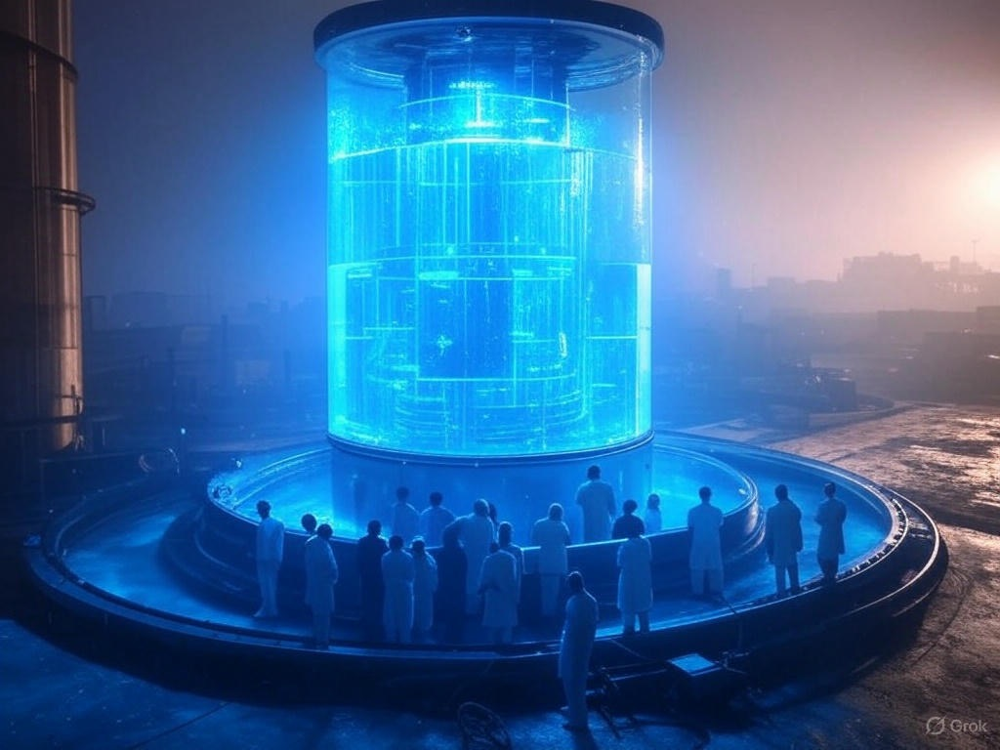
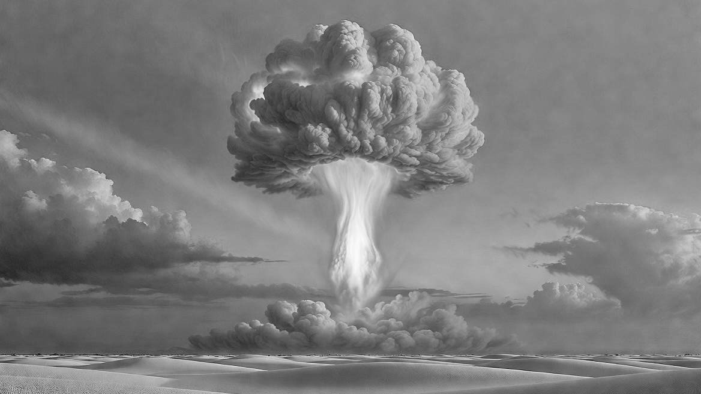
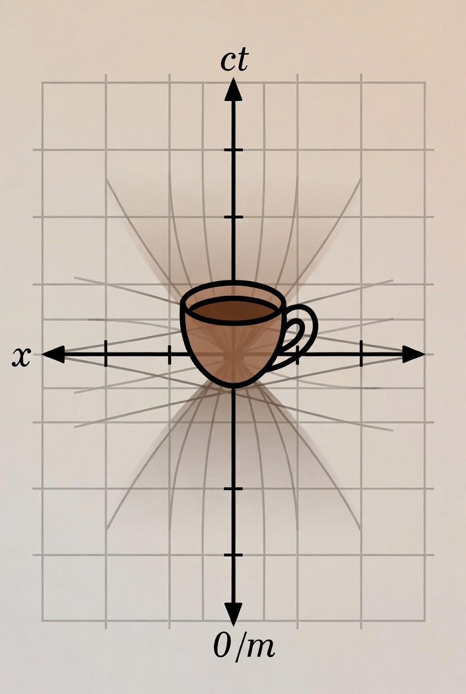

# MassEnergy: A Mass-Based Energy Conversion Layer for GNU Units

##  "Mass is not simply equivalent to energy — Mass **is** energy."

<p align="center">
  
</p>

## Overview

This project provides a small `massenergy.units` file for [GNU Units](https://www.gnu.org/software/units/). It redefines the second as the distance light travels in one second and sets the speed of light `c = 1`. Mass and energy then convert directly via \(E = mc^2\).

Through this lens, a gram is about 21 kilotons of TNT (think trinity, nagasaki, 25 MW hrs).

 A sugar cube, is about a gram  — city-scale military destruction.
 
  In comparison our Sun radiates roughly 4.2 billion (giga) kg of mass
  every second.  Or 2 billion tsar-bomba tests per second.

``` text
You have: solarluminosity s
You want: Gkg
        solarluminosity s = 4.2569991 Gkg

# Or in cold war era weapons the sun shines with the light of 2 billion Tsar-bomba detonations each second.

You have: solarluminosity s
You want: Gtsarbomba
        solarluminosity s = 1.8288719 Gtsarbomba
  ```

*Sorry, you will never see the universe quite the same again.*

### Related documentation and Spacetime -> Spaceentropy math 

| Doc / package                                                     | What it is                                                                                                                                                  |
| ----------------------------------------------------------------- | ----------------------------------------------------------------------------------------------------------------------------------------------------------- |
| **[HYPERFACET.md](HYPERFACET.md)**                                | Two-line core, project backstory, and “mind-blower” reframe of global energy as mass                                                                        |
| **[Data center power](datacenter-power.md)**                      | Power plants + data centers, waste heat vs Earth solar absorption — usage examples with `units`                                                             |
| **[Solar radiance & Earth absorption](solarradiance-earthabsorption.md)** | Solar luminosity, daily insolation, absorbed/radiated balance, and mass-energy equivalences                                                       |
| **[minkowski_entropy/](minkowski_entropy/)**                      | Space-entropy: Python doing what units alone cannot. Geometric compounding along timelike intervals (c = 1) … *and yes, it still does compounding finance.* |
| **[Spacetime-Entropy  Package(md)](minkowski_entropy/README.md)** | Spacetime Entropy & Growth/Decay Module                                                                                                                     |
| **[Twin Paradox Redux](minkowski_entropy/twin_paradox.md)**       | Classic problem looked at as an entropy reduction effect instead of a clock speed effect                                                                    |
| **[Finance examples](minkowski_entropy/README.md#finance)**       | Same math as entropy for compounding interest (readable help in the module README)                                                                          |

---

## Features

- Redefines core units: `second ≈ 299792 km`, `c = 1`
- Mass ↔ energy conversions without extra factors
- Named references for familiar nuclear yields and large-scale events
- Real-world examples from physics, history, and energy economics
- Topic notes: [data center power](datacenter-power.md), [solar radiance / Earth absorption](solarradiance-earthabsorption.md)
- Optional **Minkowski / space-entropy** math package (`minkowski_entropy`)

---

## Requirements

- [GNU Units](https://www.gnu.org/software/units/) 2.x (tested with 2.23)
- A Unix-like shell (Linux, macOS, WSL, or Cygwin)

---

## Installation

### 1. Install GNU Units

```bash
# Debian / Ubuntu / WSL
sudo apt install units

# Fedora / RHEL
sudo dnf install units

# macOS (Homebrew)
brew install units
```

On Windows, use [WSL](https://learn.microsoft.com/en-us/windows/wsl/) or [Cygwin](https://www.cygwin.com/) and install `units` inside that environment.

### 2. Get this file

```bash
git clone https://github.com/NinerXrayBravoTwoTwo/MassEnergyUnits.git
cd MassEnergyUnits
```

Or download `massenergy.units` alone from the repository.

### 3. Run it (no system install required)

Load the **system** units database first, then this file (so `m`, `J`, `g`, etc. still exist):

```bash
units -f /usr/share/units/definitions.units -f ./massenergy.units
```

Homebrew on macOS often uses:

```bash
units -f "$(brew --prefix)/share/units/definitions.units" -f ./massenergy.units
```

### 4. Optional: permanent setup

**Personal units file** (recommended for multi-user machines — each person configures their own home directory):

```bash
# Use the absolute path to your clone
echo "!include $PWD/massenergy.units" >> ~/.units
```

Then any normal `units` session picks up the definitions.

**Shell alias** (repo-local, no install into `/usr`):

```bash
# Linux / WSL
alias lightunits='units -vf /usr/share/units/definitions.units -f /path/to/MassEnergyUnits/massenergy.units'

# macOS Homebrew
alias lightunits='units -vf "$(brew --prefix)/share/units/definitions.units" -f /path/to/MassEnergyUnits/massenergy.units'
```

Add the alias to `~/.bashrc` or `~/.zshrc` as you prefer.

**Shared install** (optional; needs admin rights):

```bash
sudo cp massenergy.units /usr/share/units/
```

---

## What This File Does

| Definition            | Meaning                                                |
| --------------------- | ------------------------------------------------------ |
| `s = 2.99792458e8 m`  | One second is the distance light travels in one second |
| `c = 1`               | Speed of light is unitless                             |
| `ton_tnt = 4.184e9 J` | Standard thermochemical ton of TNT                     |

Mass and energy, space and time, are brought into direct calculable parity.

> "Time and distance are the same thing. Ergo, mass and energy are the same thing."

---

<p align="center" >
  
  </br>
  The 'Gadget', painting</br>White Sands NM, July 17, 1945</br>— 80 years ago in '25
</p>

``` perl
  * *
 * * *   Oh, We're having so much fun, making itty bitty suns!
  * *      
  -- wengland@stephsft.com 1989 — usenet
```

## Quick examples

Interactive session (`You have:` / `You want:` prompts):

### Gram → kilotons of TNT

```text
You have: g
You want: kton
        g = 21.480764 kton
        g = (1 / 0.046553278) kton
```
### Trinity yield, at White Sands test range NM, aka. GADGET

``` plaintext
You have: gadget
You want: kt
        gadget = 19 kt
        gadget = 0.8845 g
```

### Nuclear yield comparison, fatman was 1.4x littleboy

```text
You have: nagasaki
You want: hiroshima
        nagasaki = 1.4 hiroshima
```

### Sugar cube (~5 g) in hiroshima's

```text
You have: 5g
You want: hiroshima
        5g = 7.1602548 hiroshima
```

### grams to  Nagasaki's

```text
You have: g
You want: nagasaki
        g = 1.0228935 nagasaki
```
---
<p align="center">
  
</p>

### seconds to miles

In spacetime the 'now' manifold requires 4D distance of 186282.4 miles

```text
You have: s
You want: miles
        s = 186282.4 miles
```

### jupiter distance from sol convert to AU's

Jupiter is about 5.46 earth radi from the sun.

```text 
You have: jupitersundist_max
You want: au
        jupitersundist_max = 5.4570496 au
```

### Jupiter sol distance convert to hours from sun


```text 
You have: jupitersundist_max
You want: hours
        jupitersundist_max = 0.75641496 hours
```
---
<p align="center">
  
</p>

### How many Jupiter distance sol radi is a day?

It takes a day for the 'now'  spacetime cone manifold to reach a 4D spacetime diameter of 31.7 jupiter-sol radi.

```
You have: day
You want: jupitersundist_max
        day = 31.728616 jupitersundist_max
```

---

## The Cost of Electricity - in grams?
<p align="center">
  
</p>

### My latest power bill in grams of mass-energy
Total power used was 823.73 kW hours over 64 days, costing $135.06.

```text
You have: 823.73 kW hours / 64 days
You want: micro g per day
        823.73 kW hours / 64 days = 0.51554432 micro g per day

You have: 823.73 kW hours /135.06 dollars
You want: micro g per dollar
        823.73 kW hours /135.06 dollars = 0.24429762 micro g per dollar
```
The city of Seattle charges me $1 for every 0.2443 **μg** of energy I use.
 (0.0002443 mg / $)

> ### *That is a lot $money for a speck of dust.*
<div align="center"
<p align="center">
  
<p><strong>Image: Pollen</strong></p>

</p>
</div>

 On the other hand, perhaps you are stunned by the fact that the 
amount of energy I use in my house each day can actually be measured in mass that is meaningfull *at all*.

 ... at 0.156 micro gram per day
or 32.995 μg for the entire 64 day billing period.
This is actually visible under a normal light micoscope, 
at the scale of a bacteria or grain of pollen.
A little bit smaller than the width of a human hair but close.

 My take away is that we are not just passing by this energy gradient, we are wading through and into it.

 > Calculate the mass of your own power bill and see what you get.  You might be surprised.

``` plaintext
You have: 823.73 kW hours
You want: micro grams
        823.73 kW hours = 32.994836 micro gram
 ```
| Organism/Stucture | Typical mass | W hours equivalent mass | Visible under microscope? |
| ----------------- | ------------ | ----------------------- | ------------------------- |
| Pollen grain      | 10–100 ng    | 0.24965 - 2.5 kW hrs    | Yes                       |
| Tiny plant seeds  | 1–10 µg      | 25 - 249 kW hrs         | Yes                       |
| Diatom            | 2–200 µg     | 0.5 - 5 kW hrs          | Yes                       |
| Tardigrade        | 100–500 µg   | 2.5 - 12.5 kW hrs       | Yes                       |
| Human hair        | 50–100 µg    | 1.25 - 2.5 kW hrs       | Yes                       |
| Rotifer           | 50–500 µg    | 1.25 - 12.5 kW hrs      | Yes                       |
| flax seed         | 1–2 mg       | 24.97 - 49.93  MW hrs   | Yes                       |

---
<p align="center">
  
</p>

### Brain energy usage in grams of mass-energy
Converting mass to energy at 168.5 µg per year, the human brain uses about 20 watts continuous uninterrupted power.

That is about 168.5 µg of mass-energy per year.

```text
You have: 20 watt / hour * day * siderealyear
You want: micro g
        20 watt / hour * day * siderealyear = 168.54325 micro g
```
 * I am 65.5 years old. (1960 - 2026)
 * At ~168.5 µg of mass per year, I have burned the equivalent of ~11.04 mg of mass with just my brain in 65.5 years.
 * Most of that energy scavenged from the solar gradient was spent in fighting entropy, the second law.
 * Was it all worth it? :blush:

```text
You have: 20 watt / hour * day * siderealyear * 65.5
You want: milligrams
        20 watt / hour * day * siderealyear * 65.5 = 11.039583 milligrams
```

### High-end NVIDIA AI data server power usage vs. a human brain power usage

```text
You have: 10000 watt / hour * day * siderealyear
You want: 20 watt / hour * day * siderealyear
        10000 watt / hour * day * siderealyear = 500 * 20 watt / hour * day * siderealyear
                                                 ^^^ 500 human brains worth of power usage
``` 
* Human brain burns about 0.17 milligrams of mass-energy per year,
* while a high end AI data server burns about 84 milligrams of mass-energy per year.

 That is about 500 times more energy usage than a human brain.
```text
You have: 20 watt / hour * day * siderealyear
You want: mg
        20 watt / hour * day * siderealyear = 0.16854325 mg

You have: 10000 watt / hour * day * siderealyear
You want: mg
        10000 watt / hour * day * siderealyear = 84.271624 mg
```
### One-shot command line

```bash
units -f /usr/share/units/definitions.units -f ./massenergy.units '1 g' 'kton'
units -f /usr/share/units/definitions.units -f ./massenergy.units 'castlebravo' 'g'
units -f /usr/share/units/definitions.units -f ./massenergy.units '1 s' 'km'
```

### Built-in names

| Name                                 | Definition                                          |
| ------------------------------------ | --------------------------------------------------- |
| `s`, `c`                             | Second as light-travel distance; speed of light = 1 |
| `ton_tnt`, `ton_e`, `ton_tnt_energy` | 1 ton TNT = 4.184 GJ                                |
| `kton`/`kt`, `Mton`/`Mt`             | 10³ and 10⁶ tons TNT                                |
| `trinity`, `gadget`                  | 19 kt                                               |
| `hiroshima`, `littleboy`             | 15 kt                                               |
| `nagasaki`, `fatman`                 | 21 kt                                               |
| `castlebravo`, `shrimp`              | 15 Mt                                               |
| `chicxulub`, `dinokill`              | K–Pg impact energy (~4.184×10²³ J)                  |
| `solarluminosity`, `sunpower`        | Solar power (382.8 yotta W)                         |
| `nova`                               | Order-of-magnitude supernova (~10⁴⁴ J)              |
| `everestmass`                        | Mass of Mt. Everest (approx.)                       |

Yields are common public figures; historical estimates have ranges. Device and convenience names alias the primary units so mass-energy stays consistent when `c = 1`.

---

## Selected events in mass equivalents

| Event                      | Energy (J)   | Mass equivalent (g) |
| -------------------------- | ------------ | ------------------- |
| Trinity test (19 kt)       | ~8.0 × 10¹³  | ~0.88 g             |
| Hiroshima (~15 kt)         | ~6.3 × 10¹³  | ~0.70 g             |
| Nagasaki (~21 kt)          | ~8.8 × 10¹³  | ~0.98 g             |
| Castle Bravo (15 Mt)       | ~6.3 × 10¹⁶  | ~700 g              |
| Solar luminosity (per sec) | 3.828 × 10²⁶ | ~4.25 × 10⁹ g       |
| Chicxulub impact           | 4.184 × 10²³ | ~4.65 × 10⁶ g       |

The nunits authors have since incorported these constants
into the default "/units/definitions.units" data file. Several additional 'shots' are defined.
``` plaintext
$ grep -i tnt /usr/share/units/definitions.units

# The unit "tnt" is defined so that you can write "tons tnt".  The
#     explosive energy released by TNT range from 900 to 1,100 calories per
#     "kiloton" of TNT referred to a short kiloton (2*10^6 pounds), a metric
#     equivalent to 1 short kiloton of TNT if the energy release is 1,102
#     per gram of TNT.
# It is therefore not well-defined how much energy a "gram of tnt" is,
tnt                     1e9 cal_th / ton   # Defined exact value
davycrocket             10 ton tnt         # lightest US tactical nuclear weapon
hiroshima               15.5 kiloton tnt   # Uranium-235 fission bomb
nagasaki                21 kiloton tnt     # Plutonium-239 fission bomb
ivyking                 500 kiloton tnt    # most powerful fission bomb
castlebravo             15 megaton tnt     # most powerful US test
tsarbomba               50 megaton tnt     # most powerful test ever: USSR,
b53bomb                 9 megaton tnt
trinity                 18 kiloton tnt     # July 16, 1945
```

---

## Philosophy: why mass as energy?

- **Relatable:** Grams and kilograms are everyday units.
- **Tangible:** “This release was about one gram” is easier than “25 giga watt hours”
- **Intuitive scaling:** Cosmic and industrial energy use become comparable.
- **Physics:** Mass and energy are interchangeable **\(E = mc^2\)**.
    - Or just **\(E = m\)** in our case since we are using naural units
    - Which is actually the fundemental insight of relativity, that mass and energy are the same thing, time and distance are the same units of measure. Not equilvent, the same with *'restrictions'*

People have said; 
> "A loaf of bread converted entirely to energy could power the Earth for a day."

But is that really true? You now know how to actually check.

1. If a loaf of bread is about 567g; 
2. Electricity used by humans in 2023 was about 27.047 PW hours (Petawatt hours)

``` plaintext
You have: 27.047 PW hr per (siderealyear/day)
You want: 567 g
        27.047 PW hr per (siderealyear/day) = 5.2311762 * 567 g
                                              ^^^^^ actual number of loaves of bread needed
```
So No- They were incorrect, it would actually require  5.23 loaves of bread, converted to energy, to power the human race for a day. 
> You may think that this is nitpicking, however this is extreenly precise math. There is a big difference between one loaf verses five times that amount.

---

## Notes and warnings

- This file is for intuition and conversion, not Lorentz transforms or tensor calculus.
- For spacetime intuition, see *Spacetime Physics* (Taylor & Wheeler).
- Not affiliated with the GNU Units project.
- Historical nuclear yields are estimates; modern analyses sometimes revise them.

At first you will doubt this reality. Have patience,and you will see the universe in a new light
where a second really is a distance measured in meters and electricity measured in micrograms.

---

### Summary of world energy usage and economics (CIA Factbook ~2016)

| ElecProd ekg | Std x ekg/G$ | Std x ekg/TT | CapFF ekg | Std x ekg/G$ | Std x ekg/TT | EmissionTT TT |   GDP G$ |        Country |
| -----------: | -----------: | -----------: | --------: | -----------: | -----------: | ------------: | -------: | -------------: |
|        947.3 |      -28.154 |       17.312 |  1412.612 |      -32.698 |       11.967 |       33620.0 | 127800.0 |          World |
|        235.6 |        0.739 |       -2.564 |   359.847 |        0.085 |       -3.455 |       11670.0 |  23210.0 |          China |
|        164.0 |       -2.494 |        4.201 |   267.166 |       -1.970 |        4.601 |        5242.0 |  19490.0 |  United States |
|        121.9 |       -7.598 |        3.995 |   150.630 |       -9.990 |        1.506 |        3475.0 |  20850.0 | European Union |
|         55.5 |       -3.440 |        0.157 |    91.690 |       -3.184 |        0.356 |        2383.0 |   9474.0 |          India |
|         41.3 |        0.176 |       -0.038 |    58.472 |       -0.206 |       -0.458 |        1847.0 |   4016.0 |         Russia |
|         39.6 |       -1.265 |        1.012 |    73.766 |       -0.599 |        1.646 |        1268.0 |   5443.0 |          Japan |
|         26.0 |        0.793 |        1.063 |    11.589 |       -0.922 |       -0.666 |         640.6 |   1774.0 |         Canada |
|         24.5 |       -1.530 |        0.497 |    30.015 |       -2.030 |       -0.025 |         847.6 |   4199.0 |        Germany |
|         22.7 |       -0.838 |        1.025 |     9.001 |       -2.400 |       -0.551 |         513.8 |   3248.0 |         Brazil |
|         21.2 |       -0.627 |        1.241 |     7.807 |       -2.116 |       -0.259 |         341.2 |   2856.0 |         France |

---

## Global energy and economic relationships

- **ekg** means kilograms of mass-energy (the antimatter-equivalent sense).
- **GDP** is gross domestic product.

Data from the CIA World Factbook (circa 2016–2017).

| Independent (X)                 | Dependent (Y)                   | Correlation | Mean X  | Slope          |
| ------------------------------- | ------------------------------- | ----------- | ------- | -------------- |
| Electric Consumption            | Generating Capacity Fossil Fuel | 0.993       | 29.1    | 1.7 ekg/ekg    |
| Generating Capacity Fossil Fuel | GDP                             | 0.984       | 46.9    | 64.8 ekg/G$    |
| Electric Production             | GDP                             | 0.982       | 31.5    | 102.0 ekg/G$   |
| Electric Production             | CO₂ Emissions (Tt)              | 0.977       | 31.5    | 44.3 ekg/TT    |
| Fossil Fuel Gen Capacity        | CO₂ Emissions (Tt)              | 0.969       | 46.9    | 27.8 ekg/TT    |
| Nat Gas Produced                | Nat Gas Consumed                | 0.955       | 102.8   | 0.8 Gcm/Gcm    |
| Oil Reserves                    | Oil % GDP                       | 0.946       | 30974.6 | 0.0 Gbbl/%     |
| GDP                             | CO₂ Emissions (Tt)              | 0.942       | 4090.6  | 0.4 G$/TT      |
| Electric Consumption            | Renewable Gen Capacity          | 0.934       | 29.1    | 0.4 ekg/ekg    |
| Renewable Gen Capacity          | CO₂ Emissions (Tt)              | 0.932       | 12.9    | 97.9 ekg/TT    |
| Oil Export                      | Oil % GDP                       | 0.927       | 0.9     | 1.3 Mbbl/%     |
| Renewable Gen Capacity          | GDP                             | 0.923       | 12.9    | 222.1 ekg/G$   |
| Fossil Fuel Gen Capacity        | Renewable Gen Capacity          | 0.921       | 46.9    | 0.3 ekg/ekg    |
| Refined Fuel Consumed           | GDP                             | 0.918       | 3.1     | 1193.9 Mbbl/G$ |
| Oil Import                      | GDP                             | 0.914       | 1.5     | 2432.9 Mbbl/G$ |
| Hydro Gen Capacity              | CO₂ Emissions (Tt)              | 0.909       | 11.4    | 101.5 ekg/TT   |
| Fossil Fuel Gen Capacity        | Refined Fuel Consumed           | 0.903       | 46.9    | 0.0 ekg/Mbbl   |
| Refined Export                  | Nat Gas Consumed                | 0.900       | 0.8     | 132.7 Mbbl/Gcm |
| Electric Consumption            | Refined Fuel Consumed           | 0.895       | 29.1    | 0.1 ekg/Mbbl   |
| Electric Production             | Refined Fuel Consumed           | 0.893       | 31.5    | 0.1 ekg/Mbbl   |
| Refined Fuel Produced           | GDP                             | 0.892       | 2.9     | 1132.5 Mbbl/G$ |
| Fossil Fuel Gen Capacity        | Oil Import                      | 0.889       | 46.9    | 0.0 ekg/Mbbl   |
| Refined Fuel Produced           | Nat Gas Consumed                | 0.883       | 2.9     | 33.6 Mbbl/Gcm  |
| Oil Export                      | Growth Rate                     | -0.545      | 0.9     | -0.6 Mbbl/%    |

## Brief relativity summary

Energy is hard to grasp in abstract SI form. U.S. electricity use of about 3,900 TWh in 2016 is hard to picture — until you notice that as pure mass-energy it is only a few hundred pounds.

Time is not a special dimension separate from space; measuring the second as ~300,000 km makes `c = 1`. Substituting that into everyday energy formulas makes mass and energy the same unit. One kilogram is about 89.9 PJ or 25 TWh.

When you realize that time is just another distance, then in basic work-energy equations **time cancels out** and we are left with the realization that, as far as the math is concerned,
Energy is equal to mass.
> There is no actual complicated math or even calculus required to see or use this. Just Algebra :smile:

 A single gram of mass is about 21 kilotons of TNT.

 ``` text
 You have: g
You want: kt
        g = 21.480764 kt
   
You have: g
You want: GW hr
        g = 24.965422 GW hr

You have: g
You want: TJ
        g = 89.875518 TJ

# A tera watt hour is 40 grams of mass by the way.
# I mention it only because this conversion seems to come up often.
You have: TW hr
You want: g
        TW hr = 40.055402 g
 ```

## Appendix: contextual units and yield reference

| Name         | Yield          | Mass-energy | Date       | Device     | Notes                       |
| ------------ | -------------- | ----------- | ---------- | ---------- | --------------------------- |
| Trinity      | 19 kt          | ~0.88 g     | 1945-07-16 | Gadget     | First test, White Sands, NM |
| Hiroshima    | ~15 kt         | ~0.70 g     | 1945-08-06 | Little Boy | U-235 gun-type              |
| Nagasaki     | ~21 kt         | ~0.98 g     | 1945-08-09 | Fat Man    | Pu-239 implosion            |
| Castle Bravo | 15 Mt / ~63 PJ | ~701 g      | 1954-03-01 | Shrimp     | Largest U.S. test           |
| Chicxulub    | 4.184×10²³ J   | ~4.65×10⁶ g | 66 Ma      | —          | K–Pg extinction impact      |
| Solar (1 s)  | 3.828×10²⁶ J   | ~4.25×10⁹ g | Present    | —          | Solar luminosity            |
| Nova         | ~10⁴⁴ J        | ~10²⁷ g     | —          | —          | Order-of-magnitude          |

## Contributing / sharing

See **[CONTRIBUTING.md](CONTRIBUTING.md)** for issues, pull requests, and testing.

- The core deliverable is `massenergy.units` — keep it small and commented.
- Historical yield numbers may be updated when better public estimates appear; keep device aliases (`gadget`, `littleboy`, …) linked to the yield names.
- Longer essay material and exercise ideas live in `README-original.md` and `Projects.md`.

## License

[MIT](LICENSE) — Copyright (c) 1995, 2008, 2017, 2026 Jillian England.
