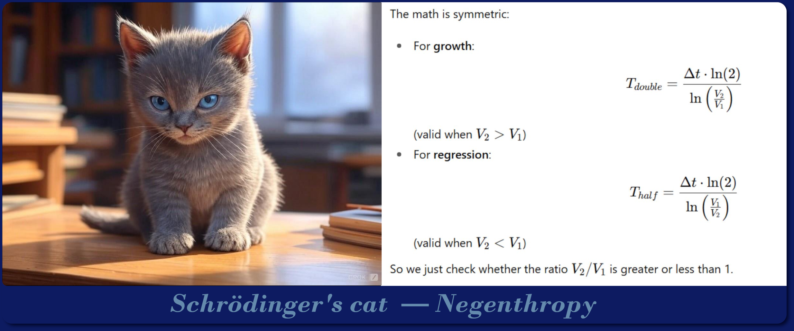

# A note from the author
## **If you ever wondered what software engineers do for fun**;
- We fly airplanes,
- We ride sport bikes,
- We Scuba dive,
- We ponder spacetime and nuclear physics and stars.
- We do math proofs because the answers are absolute and true within thier contexts.
- We ponder the rise and fall of civilizations, the ebb and flow of wars, the actual scope and limits of reality.
- We read the bible as it fits into other Helenistic writtings of the first millenia and try to piece that puzzel together.
- *What do Software Engineers do?*
- **We have fun** — and we watch our cats very closely :smile:

---

  

**Cats are predators and live to hunt.** The pure hunter chases and takes everything down.  

The reason for this is life’s **Negentropy requirements** ("What is Life?", Schrödinger 1944)

To merely exist life... particularly predators, must grow at a geometricly faster rate than entropy decays it. 

If it moves— it is huntable — which is why everything not nailed down gets pushed off tables. 

**The law of compound growth** — life
 
vs.

**The law of compound decay** — entropy

---

**Note:** *This idea can be applied directly to humans and society as well.*

*It is the tension of taxation<->working, hunting<->fighting, family<->theft, and* **war**