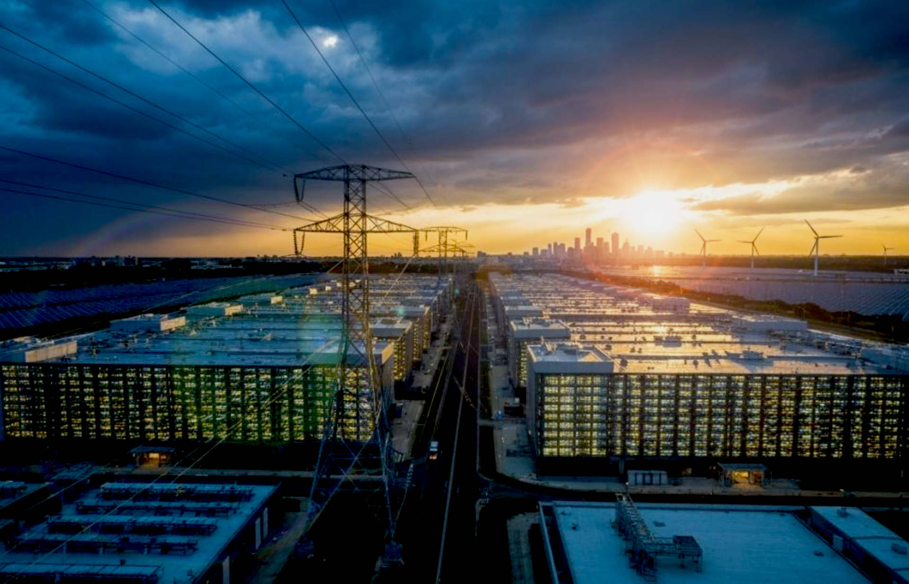
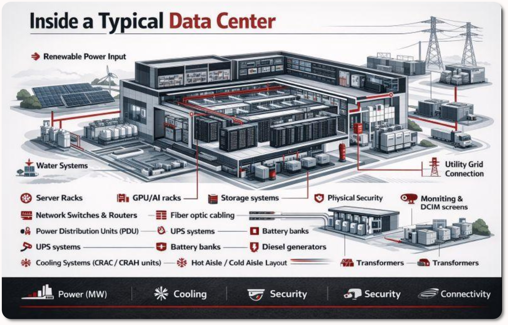

# Data Centers -- A *hot* topic :wink:
<p align="center">
  
  <h3 align="center">Data Center Power and Waste Heat Comparison</h3>
</p>

---

### Data centers are being built all over the world at scales of hundreds of megawatts of power consumption.

To power these **production** centers we are building matching power plants.

All this energy is eventually converted to heat and must be radiated away from the servers.

---

## Gas-Fired Power Plant + 500 MW Data Center

| Component                                 | Power (MW)        | Notes                                    |
| ----------------------------------------- | ----------------- | ---------------------------------------- |
| Fuel burned at power plant                | 1,000 – 1,250     | Natural gas input                        |
| Waste heat from power plant               | 500 – 750         | Dumped locally (cooling towers, exhaust) |
| Electricity delivered to data center      | 500               | Usable output from plant                 |
| Waste heat from data center               | 500               | All electricity becomes heat             |
| **Total waste heat added to environment** | **1,000 – 1,250** | Combined from plant + data center        |

A natural-gas-powered 500 MW data center (the largest being considered) would add heat to the
environment of about **1/97,600,000** of our current daily sunshine.

:sun_with_face:

``` plaintext
You have: 1250 MW
You want: earthsolarabsorbed (ESA)
        1250 MW = 1.0245902e-08 ESA
        1250 MW = (1 / 97,600,000) ESA
```

---

## Nuclear Power Plant + 500 MW Data Center

| Component                                 | Power (MW) | Notes                             |
| ----------------------------------------- | ---------- | --------------------------------- |
| Fuel burned at power plant (thermal)      | ~550       | Nuclear fission heat input        |
| Waste heat from power plant               | ~50        | Dumped via cooling towers         |
| Electricity delivered to data center      | 500        | Usable output from plant          |
| Waste heat from data center               | 500        | All electricity becomes heat      |
| **Total waste heat added to environment** | **~550**   | Combined from plant + data center |

**Key takeaway:** Nuclear is far more efficient with much less waste heat. Even the gas case is orders of magnitude below exaggerated claims like 10 GW per data center.

:sun_with_face:

A nuclear-powered 500 MW data center has considerably less waste heat when powered by nuclear instead of gas, equivalent to about **1/222,000,000** of daily sunlight.

``` plaintext
You want: ESA
        550 MW = 4.5081967e-09 ESA
        550 MW = (1 / 221,818,181) ESA
```

---
<a id="scaling"></a>
# Data Center Self-Scaling Design
<p align="center">
  
  <h2 align="center">Data Center, Servers - cooling - power,  automatic scaling</h2>
</p>

Modern hyperscale and AI data centers are engineered so that power consumption, cooling, and supporting infrastructure can scale down significantly when demand drops. The goal is to avoid wasting electricity and heat when servers are idle or powered off.

## 1. Server and Compute Layer

- **Dynamic power management**: CPUs, GPUs, and AI accelerators use dynamic voltage and frequency scaling (DVFS). Clocks and voltages drop automatically when utilization falls, reducing power draw well below peak.
- **Idle and sleep states**: Individual servers, racks, or entire rows can enter deep idle, standby, or powered-off modes. Modern AI accelerators still draw residual power in idle (often 20–40 % of peak), but full power-off of unused floors is possible and practiced during prolonged low demand.
- **Workload orchestration**: Job schedulers and cluster managers consolidate workloads onto fewer machines, allowing unused hardware to be powered down. Training clusters can be taken offline between large jobs; inference capacity can be scaled with traffic.
- **Hardware resilience**: Power cycling is managed carefully to limit thermal stress and wear, but operators routinely power-gate entire zones when utilization stays low for days or weeks.

## 2. Cooling Systems

- **Variable-speed equipment**: Fans, pumps, and chillers use variable-frequency drives so airflow and water flow track the actual heat load. As server power drops, cooling power drops in near-linear fashion.
- **Zone and modular cooling**: Cooling is often delivered by row, aisle, or floor. Unused zones can have their CRAH/CRAC units, liquid cooling loops, or evaporative systems turned down or offline.
- **Free cooling and economizers**: When outdoor conditions allow, facilities shift to outside-air or water-side economizers. These systems scale naturally with reduced internal heat.
- **Residual baseline**: Even at low compute load, some cooling remains for residual heat from networking, storage, and the still-active portions of the facility.

## 3. Power Distribution and Electrical Infrastructure

- **Modular power distribution**: Power distribution units (PDUs), busways, and UPS systems are often designed in independent zones or pods. Sections can be de-energized without affecting the rest of the facility.
- **Load following**: The facility’s total draw follows the aggregate server + cooling load. When large portions of the compute floor go idle or offline, the electrical demand seen by the utility falls correspondingly.
- **Grid interaction**: Large data centers can participate in demand-response programs, further reducing draw during grid stress or when internal utilization is low.
- **Supporting loads**: Networking, storage, lighting, and control systems continue to draw power, but these are a small fraction of the peak IT load.

## Operational Reality

The nameplate capacity (e.g., 500 MW) is the maximum design load. Actual average power and waste heat scale with real utilization. Prolonged low demand allows operators to power down entire server floors, reduce cooling plant output, and lower the facility’s grid draw. High capital cost of AI accelerators creates a strong economic incentive to keep utilization high, so deep power-downs are the exception rather than the default operating mode. When they do occur, both electricity consumption and the associated waste heat decline substantially across the entire chain—from power plant to data center.

---

# Summary of the technical design
Modern data centers are built so servers, cooling, and power distribution can all ramp down when demand falls:

Servers use DVFS *, idle/sleep states, and full power-off of racks or floors.
Cooling (fans, pumps, chillers) uses variable-speed drives and zone control so it tracks the actual heat load.
Electrical distribution is modular, allowing sections to be de-energized.
The result is that both electricity draw and waste heat fall when utilization drops. The 500 MW nameplate is only the ceiling.

    * Dynamic Voltage and Frequency Scaling

<a id="policy"></a>
## Data Center Government Policy Point

If governments object to the scale of AI data centers, the more direct (and honest) approach would be to restrict or tax the end use—AI services and heavy internet traffic—rather than trying to ban the infrastructure that serves that demand. Banning or heavily obstructing data centers while leaving demand unrestricted simply shifts the load elsewhere or creates scarcity.


I disagree with both approaches. This position is coherent: opposing both the infrastructure bans and new restrictions/taxes on AI and internet use leaves the market and technology to scale according to actual demand and economics.

---
See also: **[Solar radiance & Earth absorption](solarradiance-earthabsorption.md)** for planetary-scale context.
