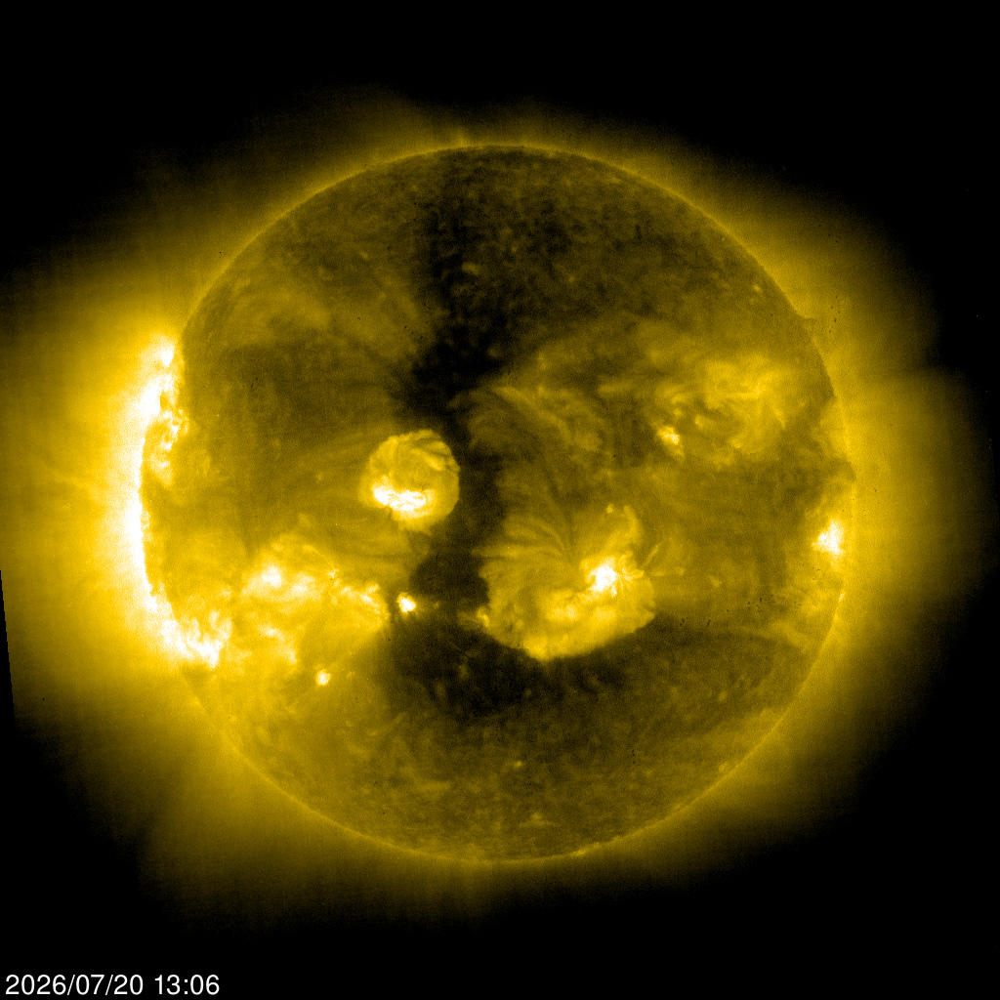

# Solar Radiance and Climate Resilience
<p align="center">
  
  <h3 align="center">Sol - July 20, 2026</h3>
</p>

---

**Earth receives about 1.51 × 10²² joules per day** at the top of the atmosphere from the Sun (using the given average solar luminosity of 384.6 yottawatts).

## Step-by-Step Breakdown

1. **Solar luminosity (L)**: 384.6 × 10²⁴ W (total power output of the Sun).
2. **Solar constant** (average flux at Earth’s distance): ~1,367–1,370 W/m². This is L spread over the surface of a sphere with radius = 1 AU.
3. **Power intercepted by Earth**: ~1.74 × 10¹⁷ W (using Earth’s cross-sectional area πR², where R ≈ 6,371 km). This is the total incoming power.
4. **Energy per day**: Multiply by 86,400 seconds/day → **~1.51 × 10²² joules/day** arriving at the top of the atmosphere.

## Absorption and Radiation (Energy Balance)

- Earth reflects ~30% (albedo from clouds, ice, etc.), so it **absorbs roughly 70%** or ~1.06 × 10²² J/day.
- **In long-term equilibrium,** Earth **radiates essentially the same amount back to space** (~1.06 × 10²² J/day on average) as thermal infrared radiation to maintain its average temperature.
- **Imbalances** drive warming/cooling over time but are insignificant at these scales and time intervals. Earth’s climate is extremely resilient and resistant to large fluctuations because of the massive solar inflow and equal daily radiation.
- **Earth’s** massive oceans and atmosphere act as stabilizing heat sinks, radiating heat to space 24 hrs each day and absorbing solar radiation durning our 12 hours of daylight.

## Context & Scale

- This is an enormous number — human civilization uses on the order of ~10¹⁸–10¹⁹ J/day globally (many orders of magnitude less).
- The value is an average; actual daily insolation varies by latitude, season, and cloud cover. Equatorial regions get far more per square meter than poles.

These figures align with standard NASA/NOAA values for Earth’s energy budget.

*Note: Calculations performed using solar luminosity of 384.6 yottawatts and standard Earth parameters (1 AU ≈ 1.496 × 10¹¹ m, Earth radius ≈ 6.371 × 10⁶ m).*

---

## Solar Radiance Equivalences

Energy release from the Sun per second.

Energy released from the Sun every second is about 6.1 billion Castle Bravo hydrogen bombs — 6 billion 20 MT H-bombs per second — :thinking:

``` plaintext
You have: solarluminosity second
You want: Gcastlebravo
        solarluminosity second = 6.0994264 Gcastlebravo
```

Energy emitted by the Sun per day (measured in mass-energy conversion)

Converting about 2.3 mountains of mass to energy each day and radiating it into space.

``` plaintext
You have: solarluminosity day
You want: everestmass
        solarluminosity day = 2.2725336 everestmass
```

---

## Sun --> Earth --> The Abyss

Each day the Earth receives 1.50336×10²² J of solar energy. It also manages to radiate the same each day.

``` plaintext
You have: earthsolarincident day
You want: J
        earthsolarincident day = 1.50336e+22 J
```

Sunlight on Earth daily is equivalent to about 239 **thousand** Castle Bravo (shrimp) bombs — yes, per day …

``` plaintext
You have: ESI day
You want: kcastlebravo
        ESI day = 239.54111 kcastlebravo
```

One year of sunshine on Earth is energy equivalent to 26 million Tsar Bombas.

I know that sounds terrifying, but it happens every year for billions of years here on Earth.

``` text
You have: ESI siderealyear
You want: Mtsarbomba
        ESI siderealyear = 26.248174 Mtsarbomba
```

---

## Data centers and waste heat

For plant + data-center waste heat compared with Earth solar absorption, see **[datacenter-power.md](datacenter-power.md)**.
